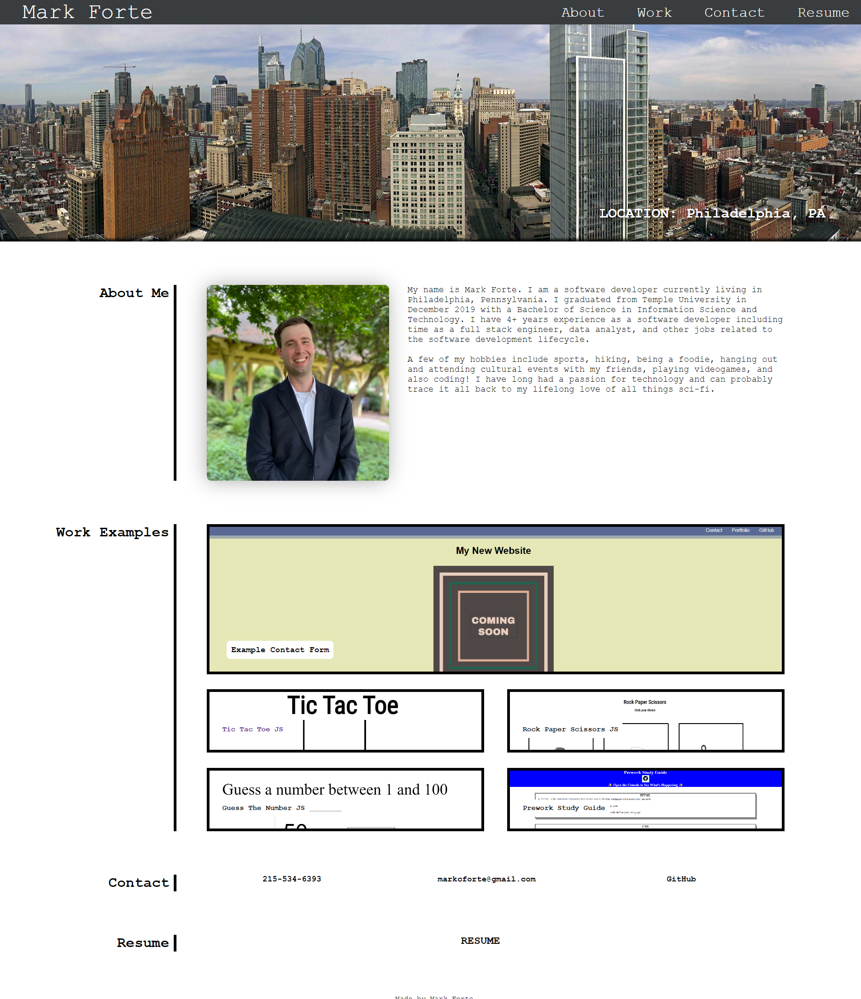

# The Developer's Portfolio

This is an example portfolio page a web developer may use to show off selected works, their resume, and a bit about themselves and their career. It is made purely with HTML and CSS. The URL to the website hosted on Github Pages: https://mforte215.github.io/the-developers-portfolio/

## Table of Contents (Optional)

- [Installation](#installation)
- [Usage](#usage)
- [Credits](#credits)
- [License](#license)

## Installation

N/A

## Usage

This site was built using semantic HTML and CSS. It displays some basic information about the developer along with links to some example projects created by the developer

The URL to the website hosted on Github Pages: https://mforte215.github.io/the-developers-portfolio/

The URL to the website repo on Github: https://github.com/mforte215/the-developers-portfolio

A screenshot of the current site:

## Credits

N/A

## License

Please refer to the LICENSE in the repo
